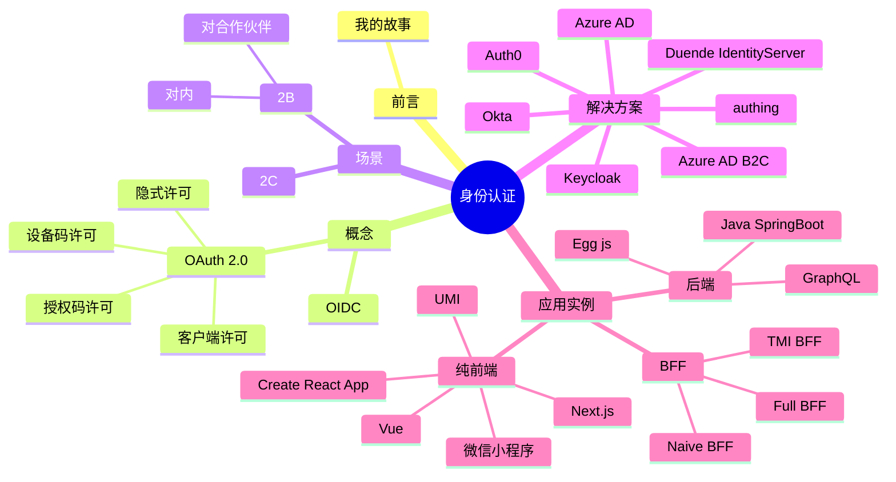
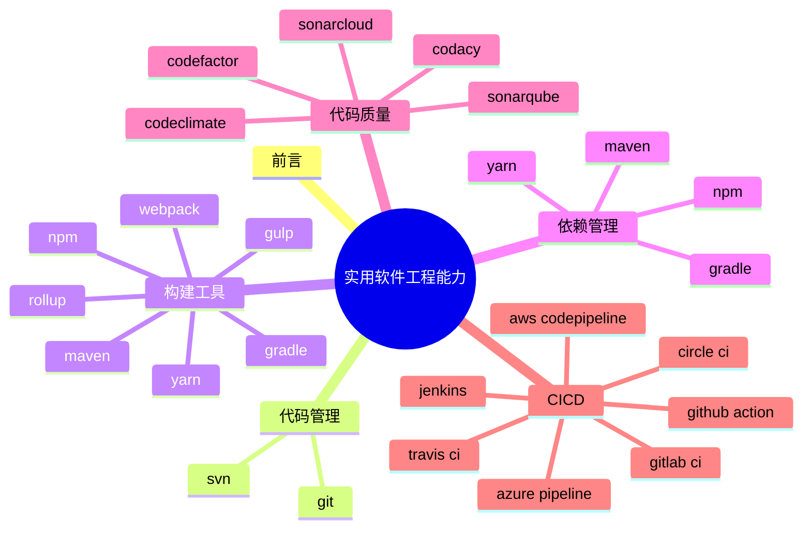

# Idea

## 身份认证

```mermaid
mindmap
  root((身份认证))
    前言
      我的故事
    概念
      OAuth 2.0
        授权码许可
        客户端许可
        隐式许可
        设备码许可
      OIDC
    场景
      2B
        对内
        对合作伙伴
      2C
    解决方案
      authing
      Keycloak
      Duende IdentityServer
      Okta
      Auth0
      Azure AD
      Azure AD B2C
    应用实例
      纯前端
        UMI
        Next.js
        Create React App
        Vue
        微信小程序
      BFF
        Naive BFF
        TMI BFF
        Full BFF
      后端
        Java SpringBoot
        Egg js
        GraphQL
```

## 实用软件工程能力

```mermaid
mindmap
  root((实用软件工程能力))
    前言
    代码管理
      git
      svn
    构建工具
        maven
        gradle
        npm
        yarn
        gulp
        webpack
        rollup
    依赖管理
        npm
        yarn
        maven
        gradle
    代码质量
        sonarqube
        sonarcloud
        codeclimate
        codacy
        codefactor
    CICD
        jenkins
        github action
        gitlab ci
        travis ci
        circle ci
        azure pipeline
        aws codepipeline
```