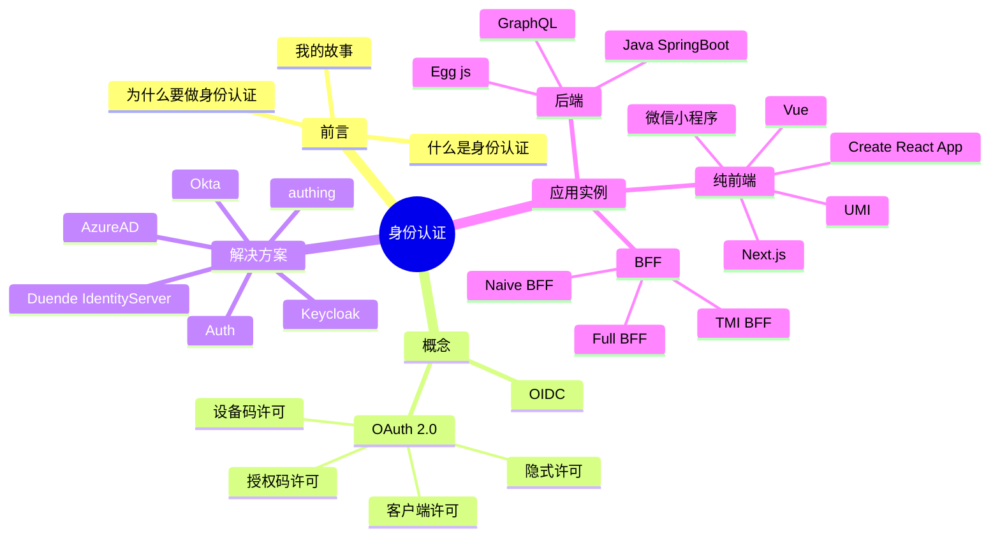

# Idea

## Mindmap

```mermaid
mindmap
  root((身份认证))
    前言
      我的故事
      什么是身份认证
      为什么要做身份认证  
    概念
      OAuth 2.0
        授权码许可
        客户端许可
        隐式许可
        设备码许可
      OIDC
    解决方案
      authing
      Keycloak
      Duende IdentityServer
      Okta
      Auth
      AzureAD
    应用实例
      纯前端
        UMI
        Next.js
        Create React App
        Vue
        微信小程序
      BFF
        Naive BFF
        TMI BFF
        Full BFF
      后端
        Java SpringBoot
        Egg js
        GraphQL
```
