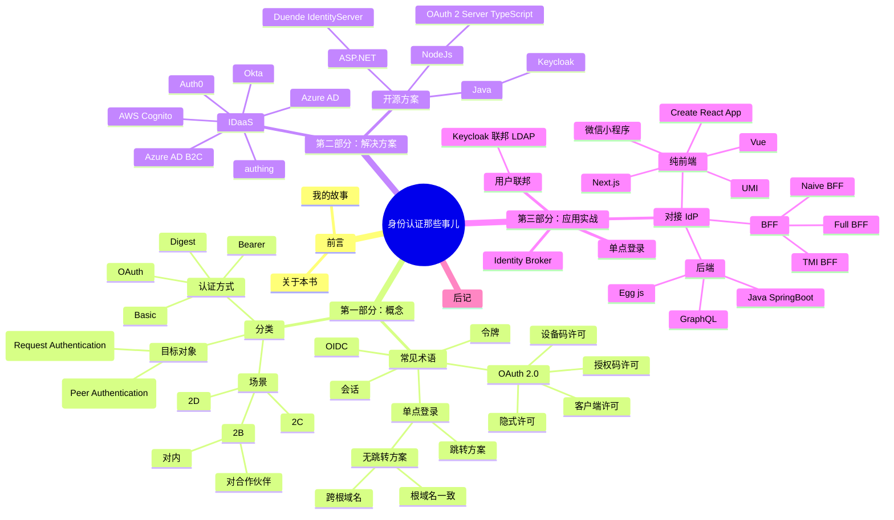
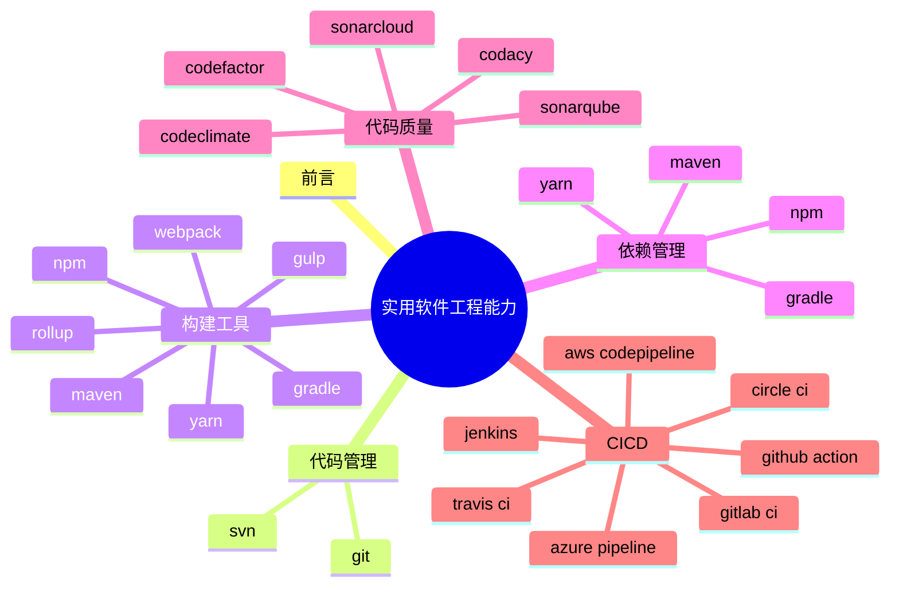

# Idea

## 身份认证

```mermaid
mindmap
  root((身份认证那些事儿))
    前言
      我的故事
      关于本书
    第一部分：概念
      常见术语
        会话
        令牌
        OAuth 2.0
          授权码许可
          客户端许可
          隐式许可
          设备码许可
        OIDC
        单点登录
          跳转方案
          无跳转方案
            根域名一致
            跨根域名
      分类
        场景
          2B
            对内
            对合作伙伴
          2C
          2D
        目标对象
          机器 (Peer Authentication)
          人类 (Request Authentication)
        认证方式
          Basic
          Digest
          OAuth
          Bearer
    第二部分：解决方案
      IDaaS
        authing
        Okta
        Auth0
        Azure AD
        Azure AD B2C
        AWS Cognito
      开源方案
        Java
          Keycloak
        ASP.NET
          Duende IdentityServer
        NodeJs
          OAuth 2 Server TypeScript
    第三部分：应用实战
      对接 IdP
        纯前端
          UMI
          Next.js
          Create React App
          Vue
          微信小程序
        BFF
          Naive BFF
          TMI BFF
          Full BFF
        后端
          Java SpringBoot
          Egg js
          GraphQL
      用户联邦
        Keycloak 联邦 LDAP
      Identity Broker
      单点登录
    后记
```

## 实用软件工程能力

```mermaid
mindmap
  root((实用软件工程能力))
    前言
    代码管理
      git
      svn
    构建工具
        maven
        gradle
        npm
        yarn
        gulp
        webpack
        rollup
    依赖管理
        npm
        yarn
        maven
        gradle
    代码质量
        sonarqube
        sonarcloud
        codeclimate
        codacy
        codefactor
    CICD
        jenkins
        github action
        gitlab ci
        travis ci
        circle ci
        azure pipeline
        aws codepipeline
```
